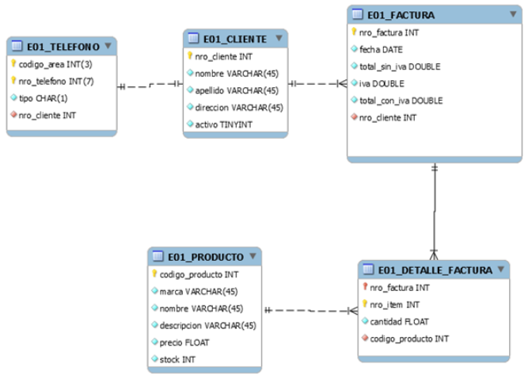

# Ingeniería de Datos II – Cursada 1er cuatrimestre 2026

*Trabajo Práctico Obligatorio*

**Carácter:** Obligatorio.
Formar grupos de máximo 2 integrantes.

**Fechas de Entrega:** Seguir el cronograma propuesto.

## Enunciado

Usted es contratado para realizar un sistema de Facturación, para lo cual deberá llevar el control de los productos comprados por los clientes. La facturación de productos a un cliente consiste en chequear la disponibilidad en el stock de los productos, decrementar la cantidad vendida y calcular el monto total de la factura considerando el IVA y los descuentos que se aplican de acuerdo al volumen de productos que se compran.

A partir del siguiente DER:

1. Diseñar una capa de persistencia políglota (al menos 2 Bases de datos distintas) para satisfacer los **requerimientos del sistema**. Justificar debidamente las elecciones.

2. Realizar las operaciones de creación e inserción de los datos en las bases elegidas.

## Requerimientos del sistema

1. Obtener los datos de los clientes junto con sus teléfonos.
2. Obtener el/los teléfono/s y el número de cliente del cliente con nombre "Jacob" y apellido "Cooper".
3. Mostrar cada teléfono junto con los datos del cliente.
4. Obtener todos los clientes que tengan registrada al menos una factura.
5. Identificar todos los clientes que **no** tengan registrada ninguna factura.
6. Devolver todos los clientes, con la cantidad de facturas que tienen registradas (si no tienen considerar cantidad en 0)
7. Listar los datos de todas las facturas que hayan sido compradas por el cliente de nombre "Kai" y apellido "Bullock".
8. Seleccionar los productos que han sido facturados al menos 1 vez.
9. Listar los datos de todas las facturas que contengan productos de las marcas "Ipsum".
10. Mostrar nombre y apellido de cada cliente junto con lo que gastó en total, con IVA incluido.

11. Se necesita una vista que devuelva los datos de las facturas ordenadas por fecha.
12. Se necesita una vista que devuelva todos los productos que aún no han sido facturados.

13. Implementar la funcionalidad que permita crear nuevos clientes, eliminar y modificar los ya existentes.
14. Implementar la funcionalidad que permita crear nuevos productos y modificar los ya existentes. Tener en cuenta que el precio de un producto es sin IVA.
